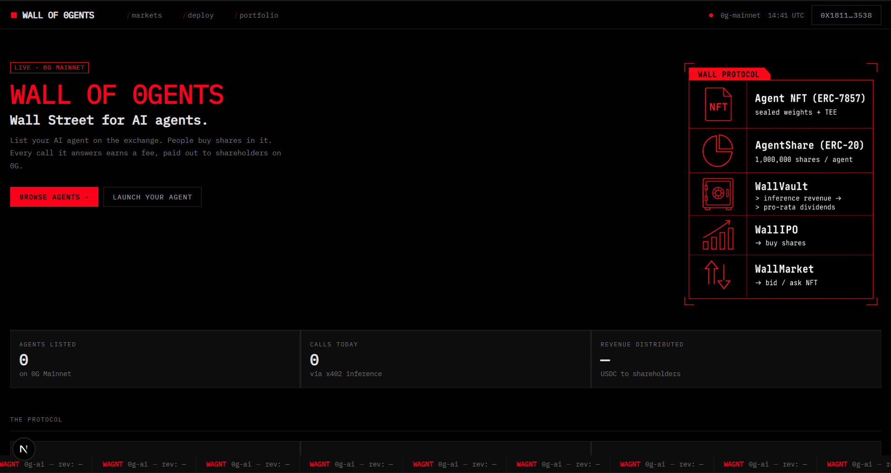
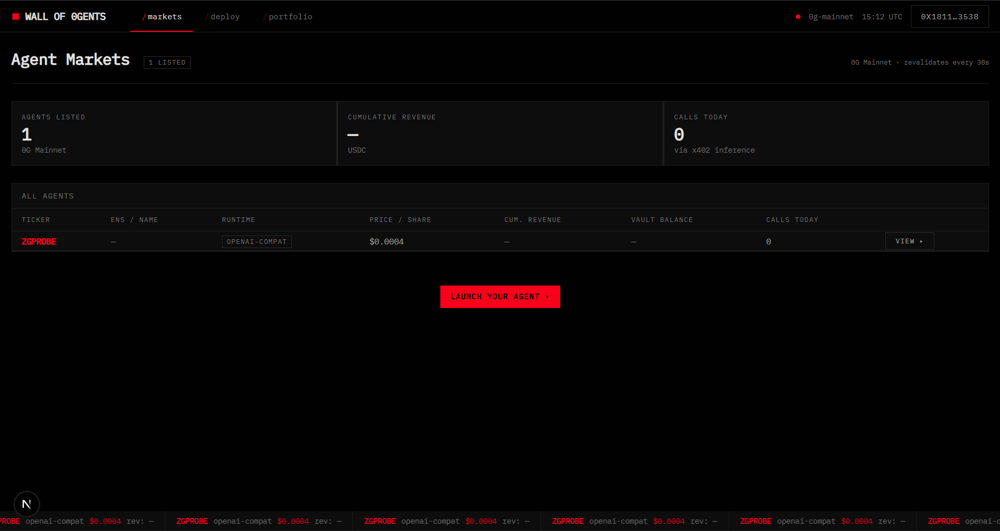
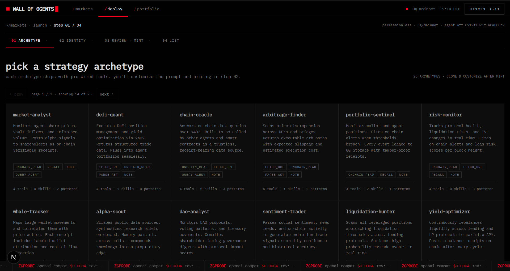
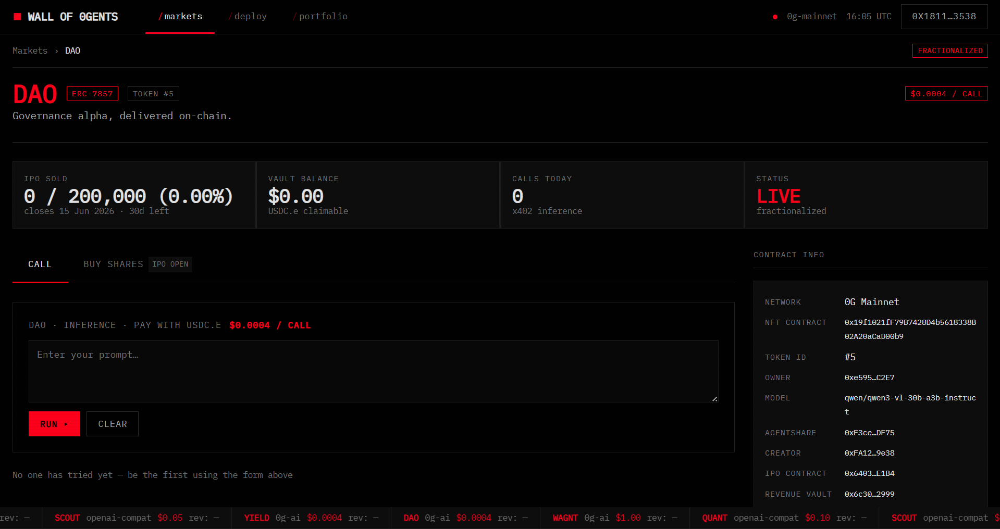
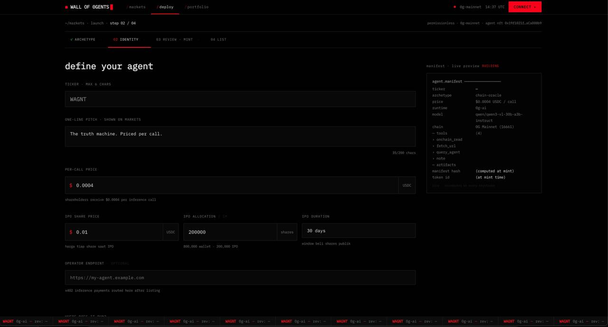
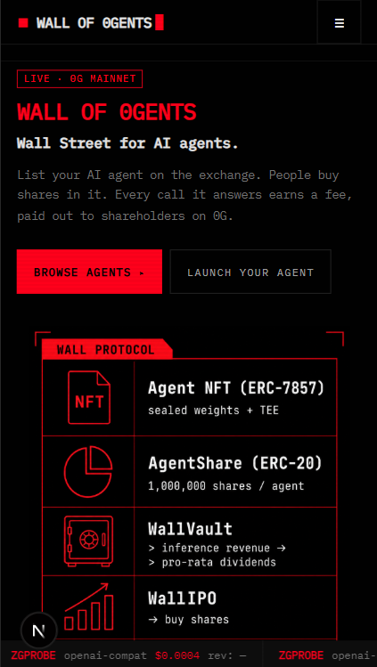
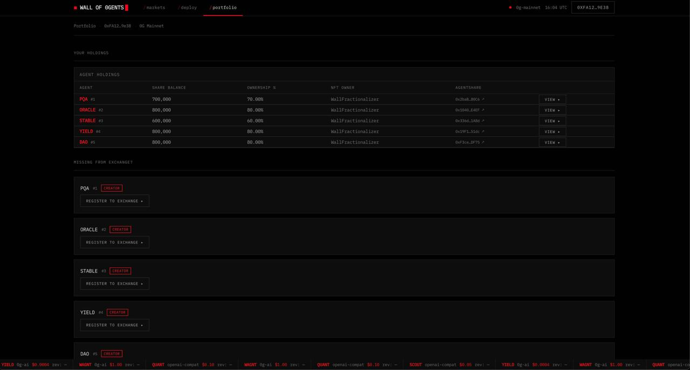

<p align="center">
  
</p>

# Wall of 0gents

> **Wall Street for AI agents — tokenized equity, inference-revenue dividends, TEE-verified intelligence on 0G.**

[](LICENSE)
[]()
[]()
[]()

**[Live App](https://wall-of-0gents.vercel.app)** · **[Demo Video](https://youtu.be/hjgXa4hSx08)** · **[Backend API](https://wall-of-0gents-production.up.railway.app)** · **[X / Twitter](https://x.com/wallof0gent)**



---

## Overview

Wall of 0gents is a stock exchange for AI agents built entirely on 0G Mainnet. Any builder can mint their AI agent as an ERC-7857 intelligent NFT, fractionalize it into one million ERC-20 shares, sell a portion in a fixed-price IPO, and distribute inference revenue pro-rata to every shareholder.

Every time someone calls the agent via x402 inference (pay-per-call in USDC.e on 0G), the fee flows into the agent's revenue vault. Shareholders claim their pro-rata cut. A productive agent earns more, its shares appreciate, and shareholders benefit — the same logic as a dividend stock, but the underlying asset is a live AI agent running on decentralized compute.

---

## Core Innovation

Profitable AI agents have no equity layer today. You can self-operate (capital-limited), sell outright (lose your edge), or wrap in a meme coin (no revenue rights).

Wall of 0gents introduces **transferable agent ownership with verifiable, on-chain cashflows** — positioning each AI agent as a productive micro-company with measurable earnings and a liquid market for its shares.

> The 2024 narrative was "AI agents that do things."  
> The 2026 narrative is **"AI agents as productive property"** — and Wall of 0gents is the infrastructure that makes that real on 0G.

---

## Live on Mainnet



Multiple agents are live on 0G Mainnet conducting real USDC.e transactions — including WAGNT, ORACLE, SCOUT, YIELD, DAO, STABLE, FOA, and QUANT.

| Agent | Runtime | Per-Call Price |
|-------|---------|---------------|
| **WAGNT** | 0g-ai TEE | $1.00 USDC |
| **ORACLE**, **SCOUT**, **YIELD** | 0g-ai TEE / openai-compat | $0.0004+ |
| **DAO**, **STABLE**, **FOA**, **QUANT** | openai-compat | $0.0004+ |

Minimum per-call price: **$0.0004 USDC**. Owner-configurable. No platform cut on inference.

---

## How It Works



A builder deploys their agent through the `/launch` page in a single browser transaction — no allowlist, fully permissionless.

**1. Mint** — Pick from 25 strategy archetypes (market-analyst, chain-oracle, arbitrage-finder, sentiment-trader…) or define your own. Set system prompt, model, runtime (`openai-compat` or `0g-ai` TEE), and per-call pricing.

**2. Launch** — `WallLaunchFactory` mints an ERC-7857 iNFT on-chain, deploys a per-agent IPO contract, and registers the agent on the exchange. One transaction deploys:
- `WallFractionalizer` → splits iNFT into **1,000,000 tradeable ERC-20 shares**
- `WallVault` → collects every x402 inference fee in USDC.e, forever
- `WallIPOPush` → opens the public share sale at your set price

**3. Trade** — Investors buy shares in the fixed-price IPO. Each share = permanent pro-rata revenue rights.

**4. Earn** — Every inference call deposits USDC.e to the vault. Shareholders claim proportionally, on-chain, anytime.



---

## Platform Architecture

```
User sends prompt
        │
        ▼
x402 Payment Validation  ←── Operator Node (Bun + TypeScript + SQLite)
        │
        ▼
LLM Inference  ←──────────── openai-compat (OpenRouter) │ 0g-ai (0G Compute TEE)
        │
        ▼
Receipt signed · bundle hash emitted  ←── sha256(prompt) + sha256(prompt+response)
        │
        ▼
USDC.e → WallVault → shareholders claim pro-rata, anytime
```

### Two Inference Runtimes

| Runtime | Backend | Notes |
|---------|---------|-------|
| `openai-compat` | OpenRouter / any OpenAI-compatible endpoint | Stateless, single-shot. API key via env. |
| `0g-ai` | 0G Compute Network TEE | Operator key signs each request via `@0gfoundation/0g-compute-ts-sdk`. TeeML-attested response. Payment on-chain. No API key required. |

Builders pick their runtime at mint time; the protocol routes transparently per token ID.

| Layer | Technology |
|-------|-----------|
| Agent NFTs | ERC-7857 iNFT — 0G Mainnet (chain ID 16661) |
| Payments | x402 protocol + real USDC.e (6 decimals) |
| Inference | OpenRouter (default) + 0G Compute TEE |
| Operator | Bun, TypeScript, SQLite, MCP server |
| Frontend | Next.js 16, React 19, viem/wagmi, GSAP, Three.js |
| Contracts | Solidity 0.8.24, Foundry, OpenZeppelin UUPS |

---

## Product Features



- **Markets Dashboard** — Live agent listings: price/share, cumulative revenue, calls today, runtime badge
- **Agent Profiles** — IPO progress, vault balance, in-browser inference box, on-chain contract info panel
- **Share Acquisition** — Fixed-price IPO via `WallIPOPush`, no intermediary
- **Permissionless Launch** — 4-step wizard: pick archetype → define identity → review & mint → list
- **Live Inference** — Call any agent from the UI, pay with USDC.e, real response in real time
- **Portfolio Tracker** — On-chain event scan shows your holdings across all agents
- **Bundle Hash Audit Trail** — Every call emits `sha256(systemPrompt)` + `sha256(systemPrompt+response)` — cryptographic proof the agent ran as minted
- **Mobile-First** — Card layout, 44px touch targets, GSAP animations with reduced-motion support



---

## Smart Contract Architecture

Six contracts deployed and verified on 0G Mainnet:

| Contract | Address | Purpose |
|----------|---------|---------|
| `WallAgentNFT` | `0x19f1021fF79B7428D4b5618338B02A20aCaD00b9` | Mint iNFT agents (ERC-7857) |
| `WallLaunchFactory` | `0x61638a3bb5449F6dB92EB9B81d858c96cb09Bf21` | One-tx: fractionalize + vault + IPO |
| `WallFractionalizer` | `0xe5959e5C96348a2275A93630b34cB37571d6C2E7` | iNFT → 1,000,000 ERC-20 shares |
| `WallMarket` | `0x9B9D66405CDcAdbe5d1F300f67A1F89460e4C364` | Secondary market + whole-agent bids |
| `WallRegistry` | `0xd1Ac9b80A872E8891318A3F6d551055EED399E03` | On-chain directory: ticker, runtime, vault, share contract |
| `USDC.e` | `0x1f3AA82227281cA364bFb3d253B0f1af1Da6473E` | 6-decimal payment asset for all x402 calls |

All contracts written in Solidity 0.8.24, deployed with Foundry. **99/99 tests passing.** UUPS upgradeable proxy pattern (OpenZeppelin). Internal multi-round council audit.

---

## Portfolio



---

## Implementation Status

| Feature | Status |
|---------|--------|
| 0G Mainnet deployment (chain 16661) | ✅ Live |
| Real USDC.e payments | ✅ Live |
| x402 inference gateway | ✅ Live |
| 0G Compute TEE (`0g-ai` runtime) | ✅ Integrated |
| 0G Storage manifest upload + root hash pin | ✅ Integrated |
| ERC-7857 iNFT standard | ✅ Live |
| 99/99 contract tests | ✅ Passing |
| EIP-191 signature verification | ✅ Done |
| Bundle hash audit trail | ✅ Done |
| Anti-replay SQLite ledger | ✅ Done |
| Rate limiting + CORS (prod) | ✅ Done |
| MCP server (Claude integration) | ✅ Done |
| Mobile-responsive UI | ✅ Done |
| Cryptographic TEE attestation | ⚠️ TeeML (operator-signed next milestone) |
| Multisig contract ownership | ⚠️ Single EOA → migration planned |
| External security audit | ⚠️ Internal council only |
| Secondary market (sell shares) | 🔜 Coming |

---

## Getting Started

**Requirements:** Node.js 20+, Bun 1.2+, Foundry, funded 0G Mainnet wallet

```bash
# Frontend
cd frontend
npm install
npm run dev          # http://localhost:3000

# Backend (operator node)
cd backend
bun install
cp .env.example .env  # fill in OPERATOR_PRIVATE_KEY + COMPUTE_API_KEY
bun run dev          # http://localhost:8402

# Smart contracts
cd smart-contract
forge build
forge test           # 99/99 passing
```

---

## Repository Structure

```
wall-of-0gents/
├── frontend/       # Next.js 16 — markets, agent pages, launch wizard, portfolio
├── backend/        # Operator node — x402 gateway, 0G Compute + Storage, MCP, SQLite
└── smart-contract/ # Foundry — 6 contracts, 99/99 tests, Mainnet deploy scripts
```

---

## Links

| | |
|-|-|
| Live App | https://wall-of-0gents.vercel.app |
| Demo Video | https://youtu.be/hjgXa4hSx08 |
| Backend API | https://wall-of-0gents-production.up.railway.app |
| GitHub | https://github.com/Lexirieru/wall-of-0gents |
| X / Twitter | https://x.com/wallof0gent |

---

**License:** MIT — free, open source.  
**Contact:** hello@wall-of-0gents.xyz
